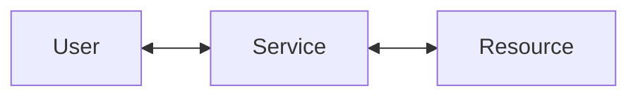

# Kerberos Delegations

<div class="hidden">
    keywords: active directory, kerberos, privesc, rbcd
</div>

## Delegations



- `user` requests for `resource` via `service`
- In other words, `service` impersonate `user` to request for `resource`
- In other words, `service` request for `resource` on behalf of `user`
- personal note: a TGS to `krbtgt` service is basically a TGT

## Unconstrained Delegation

- `service` account needs to have `TRUSTED_FOR_DELEGATION` flag **enabled**
- `user` needs to have `NOT_DELEGATED` flag **disabled** and is not a member of `Protected Users` group
- When `user` requests for TGS (`KRB_TGS_REQ`) to access `service`, the domain controller responds with TGS together with the copy of the `user` TGT
- Thus, `service` can request for **any** `resource` impersonating as `user` using the `user` copied TGT

### Abusing Unconstrained Delegation

Requirements:
- Compromised computer with unconstrained delegation

Attack:
- coerce authentication to our compromised computer to obtain a TGT
- use the TGT to do stuff

## Constrained Delegation

- `service` can **only** request for `resource` **defined** in `msDS-AllowedToDelegateTo`
- Validation is done on `service` account side
- Requires `SeEnableDelegationPrivilege` (domain admin level privilege) to modify `msDS-AllowedToDelegateTo`
- Unlike unconstrained delegation, no copy of the `user` TGT is given to the `service`

### Without Protocol Transition (Kerberos Only)

- possible attack path:
    - [Scenario 4](#scenario-4-constrained-delegation-wo-protocol-transition)
    - [Scenario 5](#scenario-5-double-kcd)
- [`S4U2Self`](#s4u2self) produces non-forwardable TGS

### With Protocol Transition (Any Authentication)

- Identified by `TrustedToAuthForDelegation` property
- [`S4U2Self`](#s4u2self) produces forwardable TGS

## Resource-based Constrained Delegation (RBCD)

- `resource` can **only** be requested from `service` **defined** in `msDS-AllowedToActOnBehalfOfOtherIdentity`
- Validation is done on `resource` account side
- Only requires rights like `GenericAll`, `GenericWrite`, `WriteDacl`, etc., to modify `msDS-AllowedToActOnBehalfOfOtherIdentity`
- Unlike unconstrained delegation, no copy of the `user` TGT is given to the `service`

## S4U2Self

- `TRUSTED_TO_AUTH_FOR_DELEGATION` appears to have no impact based on [Elad's research](https://eladshamir.com/2019/01/28/Wagging-the-Dog.html#serendipity)
- `TRUSTED_TO_AUTH_FOR_DELEGATION` (Constrained Delegation w/ Protocol Transition) only determines the `forwardable` flag on TGS:
    - If flag is set, the TGS is `forwardable`
    - If flag is **not** set, the TGS is **not** `forwardable`
- For this to work, it only requires the service performing `S4U2Self` to have SPN
- impersonating protected user would result in non-forwardable TGS

### Abusing S4U2Self

- To perform local privilege escalation
- Regardless of the impersonated user being sensitive for delegation, S4U2Self could be abused since the SPN (`sname`/service name) on the TGS can be modified as it is not encrypted


## S4U2Proxy

- Every TGS generated from `S4U2Proxy` is always forwardable

### Constrained Delegation

- requires TGS to be `forwardable`
- `user` needs to have `NOT_DELEGATED` flag **disabled** and is not a member of `Protected Users` group (such that the requested TGS is `forwardable`)
- `service` embeds the `user` TGS in `additional-tickets` field when requesting TGS to access `resource`

### Resource-based Constrained Delegation (RBCD)

- Does not require the user TGS to be forwardable but the user `NOT_DELEGATED` flag has the highest priority to determine the success of `S4U2Proxy`
- In other words, if the user can be impersonated (`NOT_DELEGATED` not set and is **not** a member of `Protected Users` group), regardless of the existence of `forwardable` flag in TGS, `S4U2Proxy` will always **success**
- If the user `NOT_DELEGATED` flag is **set** and is **not** a member of `Protected Users` group, regardless of the existence of `forwardable` flag in TGS, `S4U2Proxy` will always **fail**

## Attack Scenario

### Scenario 1 (Generic DACL Abuse)

Scenario:
- ServiceA is compromised computer account with:
    - credentials and the ability 
    - DACL write privilege to modify `msDS-AllowedToActOnBehalfOfOtherIdentity` on the desired target
- ServiceB is our desired target

Attack Path:
1. Use ServiceA's DACL write privilege to include ServiceA on ServiceB's `msDS-AllowedToActOnBehalfOfOtherIdentity`
    - result: now ServiceA is RBCD to ServiceB
2. `S4U2Self` on ServiceA impersonating non-sensitive user
    - result: TGS for non-sensitive user to access ServiceA
3. `S4U2Proxy` on ServiceA
    - result: TGS for the impersonated user to access ServiceB
    - reason: this works regardless of previous TGS forwardable flag

```ps1
.\Rubeus.exe s4u /user:ServiceA$ /rc4:$ServiceANtlmHash /domain:domain.local /msdsspn:cifs/serviceb.domain.local /impersonateuser:administrator /ptt

# Outcome: PrivEsc on `ServiceB`
```

### Scenario 2 (Reflective RBCD)

> [!WARNING]
> According to [@M4yFly](https://twitter.com/M4yFly) testing, this has been sliently patched by Microsoft

Pre-requisites:
- computer account credentials or TGT (to perform `S4U2Self`)
- `TRUSTED_TO_AUTH_FOR_DELEGATION` set on computer account (if the computer account is constrained delegation w/o protocol transition, then the `S4U2Proxy` would fail since the resulting TGS from `S4U2Self` is non-forwardable due to the absence of `TRUSTED_TO_AUTH_FOR_DELEGATION`)
- DACL to modify the computer account `msDS-AllowedToActOnBehalfOfOtherIdentity`

```ps1
# Use DACL to include `ServiceA` on `ServiceA`'s `msDS-AllowedToActOnBehalfOfOtherIdentity`

# With credentials
.\Rubeus.exe s4u /user:ServiceA$ /rc4:$ServiceANtlmHash /domain:domain.local /msdsspn:cifs/servicea.domain.local /impersonateuser:administrator /ptt

# Or with TGT
.\Rubeus.exe s4u /user:ServiceA$ /ticket:<bas64 blob> /domain:domain.local /msdsspn:cifs/servicea.domain.local /impersonateuser:administrator /ptt

# Outcome: PrivEsc on `ServiceA`
```

### Scenario 3 (Reflective RBCD Impersonating Protected Users)

> [!WARNING]
> According to [@M4yFly](https://twitter.com/M4yFly) testing, this has been sliently patched by Microsoft

Pre-requisites:
- computer account credentials or TGT (to perform `S4U2Self`)
- `TRUSTED_TO_AUTH_FOR_DELEGATION` set on computer account (if the computer account is constrained delegation w/o protocol transition, then the `S4U2Proxy` would fail since the resulting TGS from `S4U2Self` is non-forwardable due to the absence of TRUSTED_TO_AUTH_FOR_DELEGATION)
- DACL to modify the computer account `msDS-AllowedToActOnBehalfOfOtherIdentity` (?)

```ps1
# Use DACL to include `ServiceA` on `ServiceA`'s `msDS-AllowedToActOnBehalfOfOtherIdentity`

# Successful `S4U2Self`, but failed when `S4U2Proxy`
.\Rubeus.exe s4u /user:ServiceA$ /rc4:$ServiceANtlmHash /domain:domain.local /msdsspn:cifs/servicea.domain.local /impersonateuser:administrator /ptt

# Edit the `sname` field on the TGS generated from `S4U2Self` from `ServiceA$` to `cifs/servicea.domain.local`

# Outcome: PrivEsc on `ServiceA`
```

### Scenario 4 (Constrained Delegation w/o Protocol Transition)

Pre-requisites:
- computer account credentials or TGT (to perform DACL write `msDS-AllowedToActOnBehalfOfOtherIdentity`) that has constrained delegation without protocol transition
- attacker controlled account with SPN (can be achieved by creating a computer account) and no delegation

Scenario:
- ServiceA (attacker controlled account with SPN and no delegation)
- ServiceB (compromised computer account credentials that has constrained delegation without protocol transition)
- ServiceC (ServiceB's msDS-AllowedToDelegateTo target)

Attack Path:
1. Use DACL to write ServiceA on ServiceB's msDS-AllowedToActOnBehalfOfOtherIdentity
2. `S4U2Self` on ServiceA
    - result: non-forwardable TGS (administrator -> ServiceA)
    - reason: non-forwardable due to the absence of `TrustedToAuthForDelegation` on ServiceA
3. `S4U2Proxy` on ServiceA targetting ServiceB host SPN by embedding previously obtained non-forwardable TGS on `additional-tickets` field
    - result: forwardable TGS (administrator -> ServiceB)
    - reason: this works because ServiceA is not configured to be constrained delegation which does not requires the embedded TGS to be forwardable
4. `S4U2Proxy` on ServiceB targetting ServiceC SPN (according to ServiceB's `msDS-AllowedToDelegateTo` value) by embedding previously obtained forwardable TGS on `additional-tickets` field
    - result: forwardable TGS (administrator -> ServiceC)
    - reason: `S4U2Proxy` on ServiceB works because the embedded TGS is forwardable, otherwise this fails

### Scenario 5 (Double KCD)

Scenario:
- ServiceA is KCD w/ protocol transition with `msDS-AllowedToDelegateTo` set to ServiceB
- ServiceB is KCD w/o protocol transition with `msDS-AllowedToDelegateTo` set to ServiceC

Pre-requisites:
- ServiceA credentials

Attack Path:
1. `S4U2Self` on ServiceA
    - result: forwardable TGS (administrator -> ServiceA)
    - reason: forwardable as ServiceA has `TrustedToAuthForDelegation` (with protocol transition)
2. `S4U2Proxy` on ServiceA to ServiceB
    - result: forwardable TGS (administrator -> ServiceB)
    - reason: success because the embedded TGS from previous `S4U2Self` is forwardable
3. `S4U2Proxy` on ServiceB to ServiceC
    - result: forwardable TGS (administrator -> ServiceC)
    - reason: success because the embedded TGS from previous `S4U2Proxy` is forwardable

## References

- <https://en.hackndo.com/constrained-unconstrained-delegation/>
- <https://beta.hackndo.com/unconstrained-delegation-attack/>
- <https://beta.hackndo.com/resource-based-constrained-delegation-attack/>
- <https://labs.withsecure.com/publications/trust-years-to-earn-seconds-to-break>
- <https://blog.harmj0y.net/activedirectory/s4u2pwnage/>
- <https://blog.harmj0y.net/redteaming/another-word-on-delegation/>
- <https://blog.harmj0y.net/activedirectory/a-case-study-in-wagging-the-dog-computer-takeover/>
- <https://eladshamir.com/2019/01/28/Wagging-the-Dog.html>
- <https://shenaniganslabs.io/2019/01/28/Wagging-the-Dog.html>
- <https://dirkjanm.io/worst-of-both-worlds-ntlm-relaying-and-kerberos-delegation/>
- <https://dirkjanm.io/krbrelayx-unconstrained-delegation-abuse-toolkit/>
- <https://exploit.ph/delegate-2-thyself.html>
- <https://exploit.ph/revisiting-delegate-2-thyself.html>
- <https://cyberstoph.org/posts/2021/06/abusing-kerberos-s4u2self-for-local-privilege-escalation/>
- <https://en.hackndo.com/service-principal-name-spn/#edge-case---host>
- <https://attl4s.github.io/assets/pdf/You_do_(not)_Understand_Kerberos_Delegation.pdf>
- <https://www.notsoshant.io/blog/attacking-kerberos-constrained-delegation/>
- <https://www.thehacker.recipes/ad/movement/kerberos/delegations#talk>
- <https://sensepost.com/blog/2020/chaining-multiple-techniques-and-tools-for-domain-takeover-using-rbcd/>
