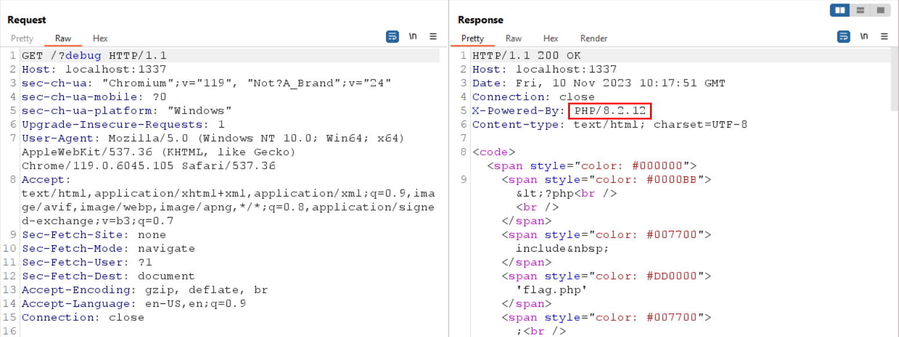
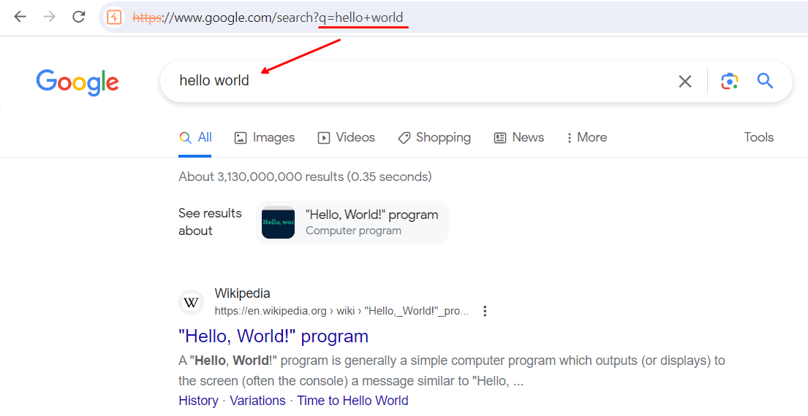

# PHP Code Review 1

<div class="hidden">
    keywords: PwC CTF: Hack A Day 2023 - Securing AI, web, php
</div>

## TL;DR

Leveraging Google search box to capture the flag

## Source Code

> [!INFO]
> This is a rough overview of the source code but is enough for solving the challenge

```php
<?php

include 'flag.php';

if (isset($_GET['debug'])) {
    highlight_file(__FILE__);
}

if (isset($_GET['url'])) {
    $url = $_GET['url'];
    $parsed = parse_url($url);
    if ($parsed['host'] == "www.google.com" && ($parsed['scheme'] == "http" || $parsed['scheme'] == "https")) {
        echo file_get_contents(str_replace("../", "/", $url) . "?flag=" . $flag);
    } else {
        die("Forbidden");
    }
}

?>
```

## Initial Analysis

From the source code above, we could see that it requires us to provide a URL
that satisfy the criterias. Searching on the internet on how to bypass
`parse_url` host leads us to this [page](https://cxsecurity.com/issue/WLB-2017070054).

Based on the PoC, for PHP < 5.6.28, the `parse_url` incorrectly parses the `host`
component. We could trick `parse_url` to think that `www.google.com` is the
host, but in fact, the real host is a webhook for us to retrieve the flag.
However, this does not work for us since if we look at the response header,
it is stated that the server is running PHP version `8.2.12`.



Seems like there is no way for us to trick the `parse_url` but to work with
`www.google.com`

## Looking at `www.google.com`

If we provide `https://www.google.com` as the `url` query value, we could see that
it just returns the page with an empty search box.


If we go to google and try to search up, e.g., `pwc hackaday 2023`, it would
redirect us to this URL: `https://www.google.com/search?q=pwc+hackaday+2023&...`.


Now, if we try to visit `https://www.google.com/search?q=hello+world` directly,
we end up with this page.



Looking back at the source code, we could see that the argument passed to `file_get_contents`
is our provided `url` appended with `?flag=`. If our provided `url` already contains
`?foo=bar`, then the appended `?flag=` would lose its `?` original syntax meaning
and instead be treated as the continuation of our initial `foo` parameter key
value, i.e., `foo = bar?flag=`

## Solution

Before we continue, let's recap back on our findings:

- `parse_url` host confusion is not possible due to mismatch PHP version
- If our provided `url` already contains `?` which signify the starting of query string, then the appended `?flag` would lose its `?` meaning
- The Google search endpoint `/search` query key `q` value is reflected back to the search box

Now, putting everything together, we could provide `url` as `https://www.google.com/search?q=`
and the flag would be appended into `https://www.google.com/search?q=?flag=...`,
which means that `?flag=...` would show up inside the Google search box.


